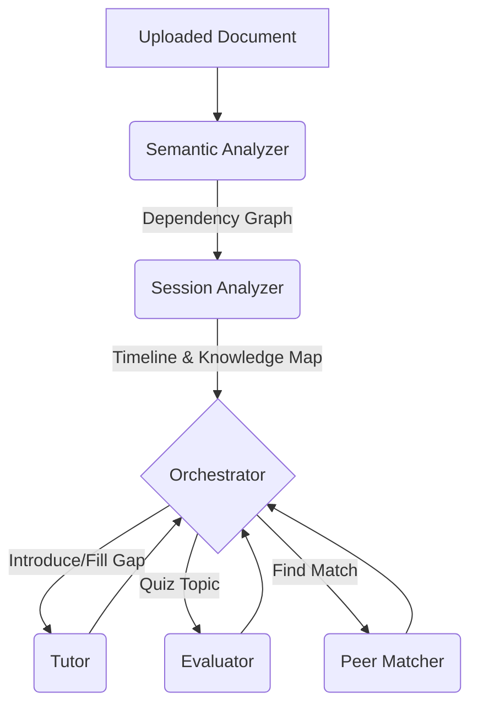

# Socrates: Active Learning Agent


> Developed and presented at **GDG Hackathon 2026**

**Socrates** is an agentic AI extension for active learning that turns your study data into a highly personalized coaching session. It features a multi-agent ecosystem designed to guide users through educational material using a multimodal interaction approach (text and voice).

## 🚀 Overview

The system processes educational material and manages a learning session structured to eliminate unnecessary cognitive load. The user experiences a split-screen interface where the original document is always visible, accompanied by a Socratic AI agent that engages them in a targeted debate rather than just providing passive summaries.

### Key Features (The 5 Agent Subsystems)

1. **The Curious Hook (Semantic Analyzer):** Generates high-level mind maps and introduces topics through intuitive metaphors to break the "boredom barrier."
2. **The Socratic Agent (Session Analyzer & Tutor):** Does not answer passively. It uses targeted maieutics (questioning) to push students to their cognitive limits, testing logical consistency.
3. **Feynman Agent (Voice Evaluation):** Challenges the student to explain a complex concept aloud. Transcriptions are evaluated for clarity, completeness, and correctness.
4. **Adaptive Engine (Evaluator):** Continuously calculates a "Delta" score between user answers and optimal responses, adjusting pacing and applying dynamic scaffolding (hints).
5. **Peer Matching:** Identifies complementary knowledge maps and matches struggling students with peers who have mastered those specific topics.

## 🧠 Architecture Diagram



## 🛠️ Tech Stack

*   **Frontend:** [Streamlit](https://streamlit.io/)
*   **Orchestration:** [LangGraph](https://python.langchain.com/v0.2/docs/concepts/#langgraph)
*   **LLM Framework:** [LangChain](https://python.langchain.com/)
*   **Data Models:** [Pydantic](https://docs.pydantic.dev/)
*   **Speech-to-Text:** [ElevenLabs](https://elevenlabs.io/)

## 📖 Documentation

*   [Architecture Overview](docs/ARCHITECTURE.md)
*   [Technical Design Document](docs/TECHNICAL_DESIGN.md)
*   [Requirements](docs/REQUIREMENTS.md)

## 🎥 Demo & Pitch Deck

The interactive pitch deck for this project is hosted on GitHub Pages:
[**View Pitch Deck**](https://ferdinandoconte.github.io/Socrates-GDG-Hackathon-2026/docs/pitch/index.html)

You can also view the short demonstration video included in the repository:
[`docs/pitch/short-demo.mp4`](docs/pitch/short-demo.mp4)

## 🚦 Getting Started

### Prerequisites
*   Python 3.11 or higher
*   An API Key for your LLM provider (Anthropic or OpenAI)
*   An ElevenLabs API Key (optional, for voice features)

### Installation

1.  **Clone the repository**
    ```bash
    git clone https://github.com/FerdinandoConte/Socrates-GDG-Hackathon-2026.git
    cd Socrates-GDG-Hackathon-2026
    ```

2.  **Install dependencies**
    ```bash
    pip install -r requirements.txt
    ```
    *Alternatively, you can install the project directly using pip:*
    ```bash
    pip install -e .
    ```

3.  **Environment Variables**
    Copy `.env.example` to `.env` and fill in your API keys:
    ```bash
    cp .env.example .env
    ```

### Running the App

Run the Streamlit application:
```bash
streamlit run app.py
```

## 📂 Project Structure

```text
Socrates-GDG-Hackathon-2026/
├── app.py                        # Streamlit entry point
├── pyproject.toml
├── requirements.txt
├── .env.example
├── agent/                        # AI Agents & LangGraph logic
│   ├── evaluator.py
│   ├── orchestrator.py
│   ├── peer_matcher.py
│   ├── semantic_analyzer.py
│   ├── session_analyzer.py
│   ├── speech.py
│   ├── state.py
│   └── tutor.py
├── data/                         # Sample data for demo
└── docs/                         # Architecture, Design, and Pitch
    └── pitch/                    # GitHub Pages Pitch Deck
```

## 👥 Team

Developed by:
*   **Ferdinando Conte**
*   **Alessandro Procoli**
*   **Nicolas Oberi**
*   **Matteo Trossi**

## 📄 License

This project is licensed under the MIT License - see the [LICENSE](LICENSE) file for details.
